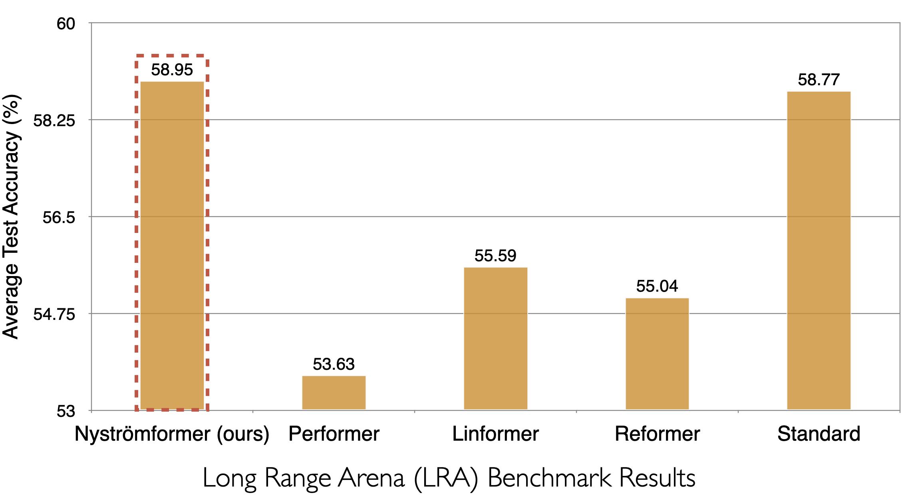

# Nystromformer: A Nystrom-based Algorithm for Approximating Self-Attention

### January 11, 2022
Nystromformer has been added to huggingface by @novice03. huggingface documentation can be found [here](https://huggingface.co/docs/transformers/master/model_doc/nystromformer).

### April 6, 2021
We extended segment-means to compute landmarks without requiring the sequence length divisible by the number of landmarks. Then we used this Nystromformer to 
perform deployment of T2T-Vit_t-14 for image classification without retraining. Our T2T-ViT-Nys-14 achieves 78% top-1 accuracy, outperforming performer/Linformer +4.3%/+12.7% for the direct deployment. 

### Feb 27th, 2021
We fixed the coefficient computation of initial Z_0, which can lead to faster convergence to pseudoinverse. The original implementation has a scale difference. 
We leave the original as a default option. The added initialization is recommended. Thanks @sbodenstein for pointing out the difference. 

### Feb 17th, 2021
We have released the source code of PyTorch reimplementation of Long Range Arena (LRA) benchmark, which is to evaluate the generalization ability of models on diverse longer sequence tasks. Our codes are based on the [official Jax LRA implementation](https://github.com/google-research/long-range-arena). Reformer PyTorch implementation is from [huggingface](https://github.com/huggingface/transformers) and Performer PyTorch implementation is from [lucidrains](https://github.com/lucidrains/performer-pytorch).

### Feb 14th, 2021
We have released the scores on individual LRA tasks. 

<p align="center">

</p>

### Feb 9th, 2021
We have release the average score across LRA tasks.

<p align="center">

</p>


Transformers have emerged as a powerful workhorse for a broad range of natural language processing tasks. A key component that drives the impressive performance of Transformers is their self-attention mechanism that identifies/encodes the influence or dependence of other tokens for each specific token. Its benefits notwithstanding, the quadratic complexity of self-attention on the input sequence length has limited its application to longer sequences – a topic being actively studied in the community. To address this limitation, we propose Nystromformer – a model that exhibits excellent scalability as a function of sequence length. Our idea is based on adapting the Nystrom method to approximate the standard self-attention with an efficient O(n) complexity.

## Requirements

```
docker, nvidia-docker
```

## Datasets

The pretraining dataset consists of English Wikipedia and BookCorpus. For pretraining on long sequence, we added one third Stories and one third Realnews. All downloaded data files should be placed in the corresponding folder under `data-preprocessing`. The original format of English Wikipedia dump is preprocessed using
[wikiextractor](https://github.com/attardi/wikiextractor), and the resulting files are placed in `data-preprocessing/wiki`. Then, run `data-preprocessing/<dataset>/preprocess.py` under each corresponding folder to generate data files of unified format. After preprocessing, run `data-preprocessing/preprocess_data_<length>.py` to generate pretraining data of specific sequence length.

## Pretraining

To start pretraining of a specific configuration: create a folder `<model>` (for example, `nystrom-512`) and write `<model>/config.json` to specify model and training configuration, then under `<model>` folder, run
```
docker run --rm --name=pretrain \
  --network=host --ipc=host --gpus all \
  -v "$PWD/../data-preprocessing/512-roberta:/dataset" \
  -v "$PWD/../code:/code" \
  -v "$PWD:/model" \
  -d mlpen/bert_env:0 \
  /bin/bash -c \
  "python3 /code/run_pretrain.py >> /model/pretrain.txt 2>&1"
```
All outputs will be redirected to `<model>/pretrain.txt`. The command will create a `<model>/model` folder holding all checkpoints and log file. The training can be stopped anytime by running `docker kill pretrain`, and can be resumed from the last checkpoint using the same command for starting pretraining.

## Pretraining from Different Model's Checkpoint

Copy a checkpoint (one of `.model` or `.cp` file) from `<diff_model>/model` folder to `<model>` folder and add a key-value pair in `<model>/config.json`: `"from_cp": "/model/<checkpoint_file>"`. One example is shown in `nystrom-4096/config.json`. This procedure also works for extending the max sequence length of a model (For example, use `nystrom-512` pretrained weights as initialization for `nystrom-4096`).

## GLUE

To finetune model on GLUE tasks, download GLUE datasets and place them under `glue` folder, then under folder `<model>`, run
```
docker run --rm --name=glue \
  --network=host --ipc=host --gpus all \
  -v "$PWD/../glue:/glue" \
  -v "$PWD/../code:/code" \
  -v "$PWD:/model" \
  -d mlpen/bert_env:0 \
  /bin/bash -c \
  "python3 /code/run_glue.py --batch_size 32 --lr 3e-5 --epoch 5 --task MRPC --checkpoint 99 >> /model/glue.txt 2>&1"
```
`batch_size`, `lr`, `epoch`, `task`, `checkpoint` can be changed to finetune on different task, different hyperparameters, or different checkpoints. All outputs will be redirected to `<model>/glue.txt`. The log file is located at `<model>/model` folder.

## Citation
```
@article{xiong2021nystromformer,
  title={Nystr{\"o}mformer: A Nystr{\"o}m-based Algorithm for Approximating Self-Attention},
  author={Xiong, Yunyang and Zeng, Zhanpeng and Chakraborty, Rudrasis and Tan, Mingxing and Fung, Glenn and Li, Yin and Singh, Vikas},
  booktitle={Proceedings of the AAAI Conference on Artificial Intelligence},
  year={2021}
}
```
